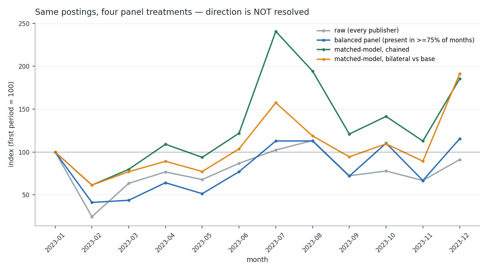
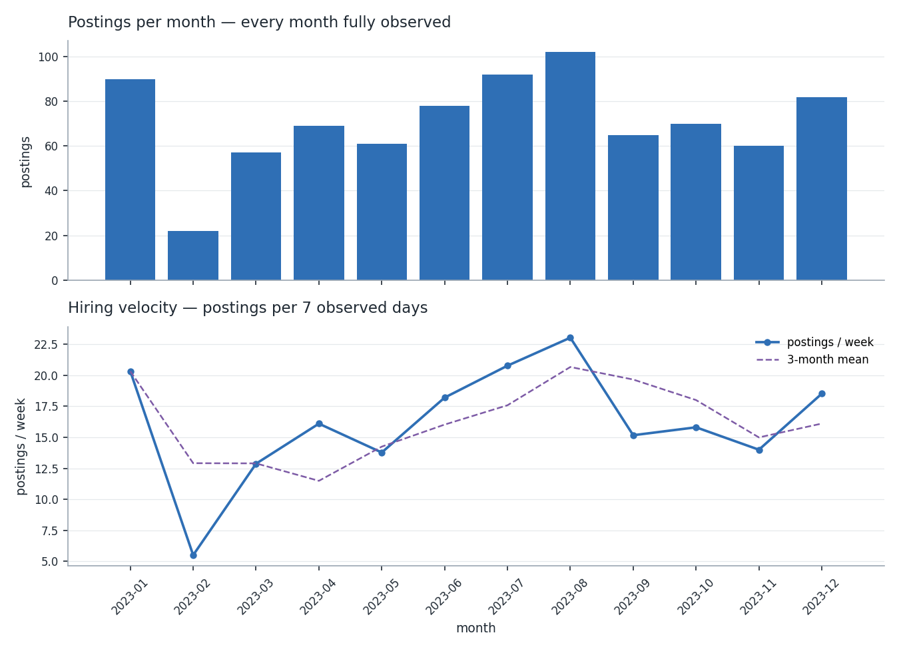
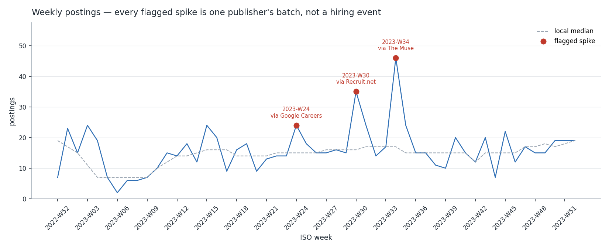
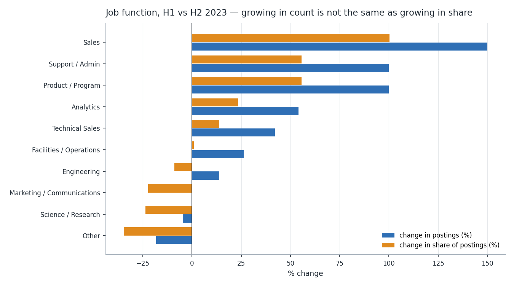
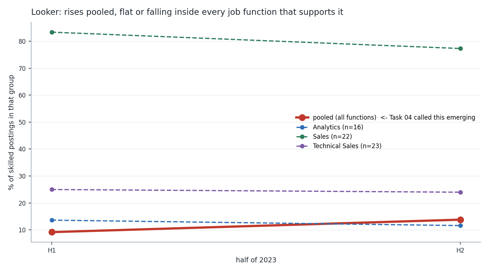
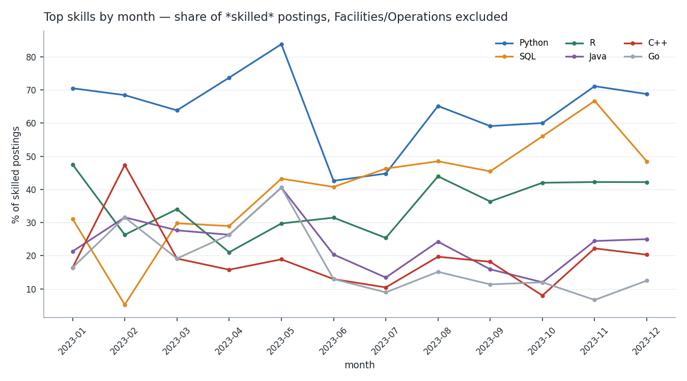
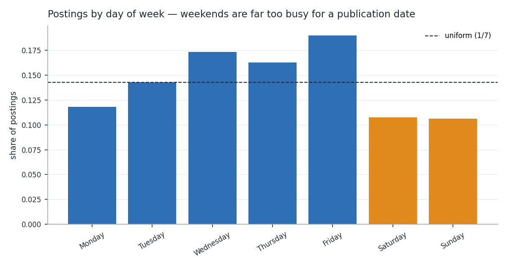

# Task 05 — Hiring Trend Analysis Report (Google)

**Specialist:** Ankit Ranjan · **Company:** Google (Alphabet) · **Date:** 2026-08-03

Input: 848 Google-family postings with Task 04 skill features
(`data/processed/google/google_features.parquet`), covering **2023-01-01 to
2023-12-31**. Output: 19 aggregate trend tables, 8 figures and a machine-readable
evidence report.

- **Method rationale (team standard):** [`docs/task-05-trend-analysis-methods.md`](../../docs/task-05-trend-analysis-methods.md)
- **Code:** [`src/trends.py`](../../src/trends.py) · [`src/build_trends.py`](../../src/build_trends.py)
- **Tests:** [`tests/test_trends.py`](../../tests/test_trends.py) — 57 new, **214 passing** in the suite
- **Machine-readable report:** [`task-05-trend-report.json`](task-05-trend-report.json)
- **Tables:** [`task-05-tables/`](task-05-tables/) · **Figures:** [`task-05-figures/`](task-05-figures/)

```bash
python src/build_trends.py --company google
python -m pytest tests/ -q
```

**Every number below is within-2023, from a single collection window and a
single upstream dataset.** None of it is a claim about Google's hiring in any
other year.

---

## 1. The headline is that the headline cannot be stated

The obvious deliverable for this task is a sentence of the form "Google's
hiring grew/shrank X% over 2023." I cannot write that sentence honestly, and
the reason is the most useful thing Task 05 produced.

Our postings do not come from Google. They come from **96 different
publishers** — job boards and aggregators — and which of them are in the feed
changes every month. Exactly **one** publisher is present in all twelve
months. **56 of the 96 appear in a single month only.**

So "more postings this month" has two indistinguishable explanations: Google
posted more, or we could see more. Separating them requires declaring which
publishers you are counting. I computed four defensible treatments of the same
848 postings and indexed each to January = 100:

| Treatment | Dec index | Reads as |
| --- | --- | --- |
| Raw — every publisher | **91.1** | mild decline |
| Balanced panel — publishers in ≥75% of months | **115.4** | modest growth |
| Matched-model, chained | **185.4** | strong growth |
| Matched-model, bilateral vs January | **191.2** | strong growth |



One dataset, four answers spanning −9% to +91%. `panel_verdict()` returns
`direction = growth, treatments_agree = False`, and the correct report is that
**the direction of Google's 2023 posting volume is not identified by this
data**.

The spread is not a modelling artefact I can tune away. Each treatment answers
a different question. Raw measures total visible supply. The balanced panel
measures three publishers (BeBee, LinkedIn, Trabajo.org) covering 44% of
postings, and inherits whatever those three did. The chained index uses every
matched pair but compounds its links — the February link rests on **3 matched
publishers**, and that error propagates through the remaining ten months. The
bilateral index avoids drift but its December comparison rests on **5
publishers** that also existed in January.

What I can state, with the panel attached:

- On the raw feed, H1 → H2 is **+24.9%** (377 → 471 postings).
- On the balanced panel, H1 → H2 is **+56.5%** (147 → 230).
- Both halves and both panels agree the second half of 2023 carried more
  Google postings than the first. **The sign of the January→December trend is
  what fails**, because December is the month where the panel is thinnest
  (16 publishers, down from 23 in January).

---

## 2. Velocity, once exposure is normalised

Hiring velocity is postings per 7 **observed** days, not per calendar month —
otherwise February's 28 days read as a 10% slowdown.



| | |
| --- | --- |
| Median | **15.95 postings/week** |
| January | 20.32/week (90 postings, 23 publishers) |
| August (peak) | 23.03/week (102 postings) |
| February (trough) | **5.50/week** (22 postings, **6 publishers**) |
| December | 18.52/week (82 postings, 16 publishers) |

**February is a collection gap, not a hiring freeze.** Publisher count drops
from 23 to 6 and back to 21 in March. No plausible hiring story moves volume
−73% and then +134% in eight weeks; a feed that briefly lost 17 publishers
does exactly that. February should be treated as missing in Task 07, not
modelled as a low month.

Quarterly, the shape is cleaner and less panel-sensitive: Q1 13.1/week → Q2
16.0 → Q3 19.7 → Q4 16.1. **Q3 is the peak on every treatment.**

### The partial-period trap

The ISO-week series opens with `2022-W52` — 2023-01-01 is a Sunday, so ISO
files New Year's Day under the previous year. That bucket has **one observed
day carrying 7 postings**, which normalises to *49 postings/week*: the largest
value in the entire year's series, and pure artefact. Any period observed for
under half its length now reports no rate at all. Without that rule the
obvious reading of this dataset is "Google's hiring peaked in the first week of
January and collapsed."

---

## 3. All three spikes are publisher batches

Robust detection (rolling median/MAD, Poisson fallback when MAD is 0) flags
three weeks. Attribution — each publisher's surplus over its *own* typical
level, against the week's excess over its local median — assigns all three to a
single publisher:

| Week | Postings | Excess | Publisher | Excess explained | Largest day |
| --- | --- | --- | --- | --- | --- |
| 2023-W24 | 24 | 9 | via Google Careers | **1.56** | 8 |
| 2023-W30 | 35 | 19 | via Recruit.net | **0.79** | 13 |
| 2023-W34 | 46 | 29 | via The Muse | **0.79** | 21 |



W34 is the clearest case. It is Google's biggest posting week of 2023 by a
wide margin, and it is The Muse's **first month in the feed** — 21 postings on
2023-08-23, a backfill of existing listings on the day the source was
connected. Reading it as a hiring surge would be reading our own collection
schedule.

More broadly, **8 same-publisher same-day batches of ≥5 postings carry 71
postings, 8.4% of the dataset**. Weekly analysis of this data is not safe
without that correction; monthly is the shortest period I would report.

---

## 4. What is actually moving inside Google's postings

Composition is more robust than level, because a mix shift does not depend on
how many publishers are in the feed — and it is what the brief's "growth,
decline or seasonal spikes" question is really after.



Count growth and share growth disagree, and both are reported:

| Job function | H1 → H2 count | Count Δ | Share Δ | Direction |
| --- | --- | --- | --- | --- |
| Sales | 10 → 25 | +150.0% | **+100.4%** | growth |
| Analytics | 61 → 94 | +54.1% | +23.4% | stable→growth¹ |
| Technical Sales | 57 → 81 | +42.1% | +13.8% | stable |
| Engineering | 108 → 123 | **+13.9%** | **−8.9%** | stable |
| Science / Research | 85 → 81 | −4.7% | **−23.7%** | stable |

¹ direction changes on the balanced panel — see §5.

Engineering is the sentence this table exists to prevent: Google posted **more**
engineering roles in H2 while engineering became a **smaller** share of what it
posted. Both are true; only one is "growth."

By technical domain the strongest signal is a decline, and it is the most
robust finding in this report because it survives every panel treatment:

| Job category | H1 → H2 | Count Δ | Share Δ | Survives rebalancing |
| --- | --- | --- | --- | --- |
| **Data Engineering** | 52 → 31 | **−40.4%** | **−52.3%** | **yes** |
| Data Analytics / BI | 88 → 136 | +54.5% | +23.7% | yes |
| AI / ML | 35 → 49 | +40.0% | +12.1% | yes |
| Data Science | 88 → 115 | +30.7% | +4.6% | no |

**Google's 2023 posting mix moves away from building pipelines and toward
analysing what is already in them.** Data Engineering more than halves as a
share while Analytics/BI grows by nearly a quarter, and the analytics-facing
job functions (Analytics, Sales, Technical Sales) all gain share at
Engineering's and Research's expense.

---

## 5. Geography barely survives the panel check

Rule 3 from Task 04 (stratify by publisher) applies to every breakdown, so
each one is recomputed on the balanced panel:

| Dimension | Segments | Directions that survive |
| --- | --- | --- |
| `job_function` | 10 | 7 |
| `job_category` | 13 | 7 |
| `country` | 48 | **21** |

The country breakdown is the weakest, and the reason is structural rather than
statistical: publishers are regional. Trabajo.org and BeBee are
Spanish-language boards, Recruit.net is Asia-facing. A country trend built on
the raw feed is substantially a statement about which regional aggregator was
connected that month.

The two headline geographic "growth stories" both fail:

| Country | Raw H1→H2 | Raw verdict | Balanced verdict |
| --- | --- | --- | --- |
| Singapore | 22 → 57 (+159%) | growth | **stable** |
| Ireland | 5 → 29 (+480%) | growth | **insufficient support** |
| India | 27 → 42 (+56%) | stable | **growth** |
| United States | 103 → 125 (+21%) | stable | stable ✓ |

To be precise about what "does not survive" means: only **one** country
(Chile) actually flips sign; **24 of the 27** disagreements are the balanced
panel losing enough postings to judge at all. So the country trends are
mostly *unverifiable* rather than demonstrably wrong — but unverifiable is
what I have to report. The United States, the largest market at 228 postings,
is the one geography whose direction holds on both panels.

**Task 06 should not compare the four companies by country.**

---

## 6. Task 04's emerging-skill list does not survive stratification

Task 04 §5 flagged skills as emerging on pooled half-over-half shares and
explicitly deferred the mix check to Task 05. Running it changes the answer for
**8 of the 29 skills** that have enough support.

### Looker: the case that matters

Task 04 flagged Looker **emerging**: 9.2% → 13.8% of skilled postings, +50%.
Inside every job function that supports the comparison, it is flat or falling:



| Job function | H1 | H2 | n |
| --- | --- | --- | --- |
| Analytics | 13.6% | 11.6% | 16 |
| Sales | 83.3% | 77.3% | 22 |
| Technical Sales | 25.0% | 24.0% | 23 |

`falling_in_all_segments`. The pooled rise is entirely mix: Sales grew from
2.3% to 6.5% of skilled postings and Analytics from 17.2% to 25.6%, while
Looker-light Science/Research fell from 29.7% to 23.2%. **Google is not
adopting Looker; Google is posting more Looker-shaped jobs.** Textbook
Simpson's paradox, in the live finding of the previous task.

### The full verdict table

| Verdict | n | Skills |
| --- | --- | --- |
| `rising_in_all_segments` | 3 | **SQL** (5 segments), **R**, **Machine Learning** |
| `falling_in_all_segments` | 5 | Looker, Go, Java, Scala, JavaScript |
| `mix_dependent` | 7 | Python, BigQuery, Linux, C++, TensorFlow, Tableau, MATLAB |
| `insufficient_support` | 14 | (fewer than 2 segments clear the floor) |

SQL is the one unambiguous rise in the dataset: 31.8% → 50.6% pooled, **and up
inside all five supported job functions**. That is a real broadening of SQL
into non-engineering roles, not a composition effect.

Python is the cautionary one in the other direction — pooled it *falls*
(64.4% → 60.3%), but it rises in two of four functions. The pooled decline is
also mix. Neither the rise nor the fall should be reported without the
stratification.



Full detail in [`skill-stratified-verdicts.csv`](task-05-tables/skill-stratified-verdicts.csv)
and [`skill-trend-within-function.csv`](task-05-tables/skill-trend-within-function.csv).
Both use `share_of_skilled` and exclude Facilities/Operations, per Task 04 §8.

---

## 7. Seasonality is not measurable, and the date field is not what it claims

The brief asks for seasonal spikes. With one calendar year:

**Month-of-year is not identifiable.** One observation per calendar month,
**zero complete annual cycles**. The 2023 monthly index is published as a
description of 2023, but any "August is a strong month" claim is confounded
with the trend and with the publisher panel. `seasonality.csv` carries
`identifiable = False` and `observations_per_level = 0` for every month row so
nobody downstream mistakes it for a seasonal factor.

**Day-of-week is identifiable** (53 observations per level) — and it produces
the most consequential caveat in this report:



| Day | Share | vs uniform |
| --- | --- | --- |
| Friday | 19.0% | 1.33 |
| Wednesday | 17.3% | 1.21 |
| Monday | 11.8% | 0.83 |
| Saturday | 10.7% | 0.75 |
| Sunday | 10.6% | 0.74 |

**21.3% of postings fall at a weekend, against 28.6% under uniformity.** A
genuine employer publication date would be near zero at weekends. Seven
postings are dated 1 January. So `posting_date` is an **aggregator first-seen
date**, not the date Google published the role. The weekday tilt is real but
modest — consistent with a crawler that runs daily and finds slightly less on
weekends, not with an employer's publishing calendar.

This is a Task 07 constraint, not a curiosity: the series is a *discovery*
process convolved with a hiring process, and its short-horizon dynamics belong
partly to the aggregators.

---

## 8. Limitations

1. **Volume direction unidentified** (§1). Reportable only with its panel
   treatment attached.
2. **One year, one upstream source.** Every claim is within-2023. No
   year-over-year comparison, no annual seasonality, and no ability to
   distinguish a 2023 pattern from a Google pattern.
3. **February is a collection gap** (§2), not a hiring trough.
4. **8.4% of postings arrive in publisher batches** (§3). Weekly resolution is
   not safe.
5. **`posting_date` is a discovery date** (§7).
6. **Country trends are mostly unverifiable** (§5).
7. **The balanced panel is small** — 3 publishers, 44% of postings. It is a
   robustness check, not a better dataset; it is biased toward whatever those
   three boards over-represent.
8. **Skill trends inherit Task 04's coverage bias.** `via Google Careers` has
   19.1% skill coverage against 82.6% elsewhere, so the skilled-posting
   denominator is itself publisher-dependent. Stratifying by job function
   controls the mix but not this.
9. **No text signal.** Task 03's Layer B is still idle (the backfill has no
   description text), so skills come from the source field and titles only.

---

## 9. What Tasks 06 and 07 inherit

**Task 06 (Competitor Comparison):**
- Compare on the **balanced panel and matched index**, never raw counts. Raw
  volume across companies is largely a comparison of how many boards syndicate
  each employer.
- Do **not** compare by country (§5).
- Use `share_of_skilled` with Facilities/Operations excluded, and carry the
  stratified verdict with any skill claim.
- The mix shift in §4 (Data Engineering down, Analytics/BI up) is the
  comparable finding — ask whether the other three companies show it too.

**Task 07 (Demand Forecasting):**
- Model **`log_growth` on the balanced panel**; percentage changes are
  asymmetric and this series swings >70% month to month.
- **Fit no annual seasonal term** (§7).
- Treat **February as missing**, not as a low month (§2).
- **Exclude or dummy W24, W30 and W34** — measurement, not demand (§3).
- Monthly is the shortest safe frequency.
- `posting_date` is a discovery date, which caps the credible horizon well
  short of a year.

**Task 09 (Insight Generation):** every trend sentence carries its panel
treatment and its stratified verdict. "Looker is emerging at Google" is
precisely the sentence this task exists to prevent.

---

## 10. Deliverables

| Artefact | Path |
| --- | --- |
| Team method standard | [`docs/task-05-trend-analysis-methods.md`](../../docs/task-05-trend-analysis-methods.md) |
| Shared module | [`src/trends.py`](../../src/trends.py) |
| Runner | [`src/build_trends.py`](../../src/build_trends.py) |
| Tests | [`tests/test_trends.py`](../../tests/test_trends.py) — 57 new, 214 passing |
| Trend tables (19 CSVs) | [`task-05-tables/`](task-05-tables/) |
| Figures (8 PNGs) | [`task-05-figures/`](task-05-figures/) |
| Evidence report | [`task-05-trend-report.json`](task-05-trend-report.json) |

Aggregate tables and figures are committed; they carry counts, shares and
indices only. Row-level data stays git-ignored, and Task 05 wrote none. The
standing Task 01 check `personal_data_columns_present` was re-run over every
table produced and is **empty**.
