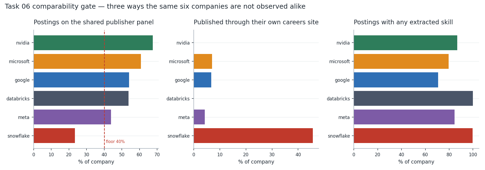
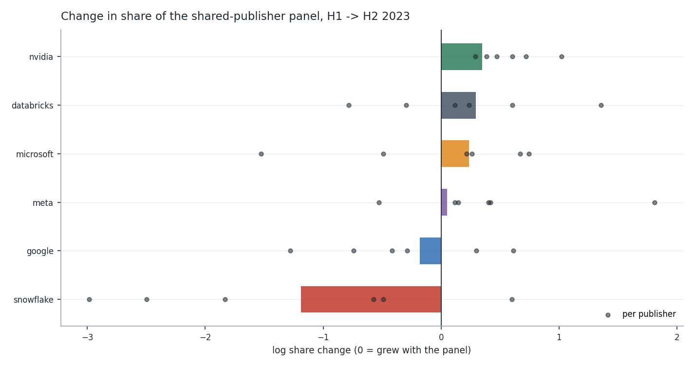
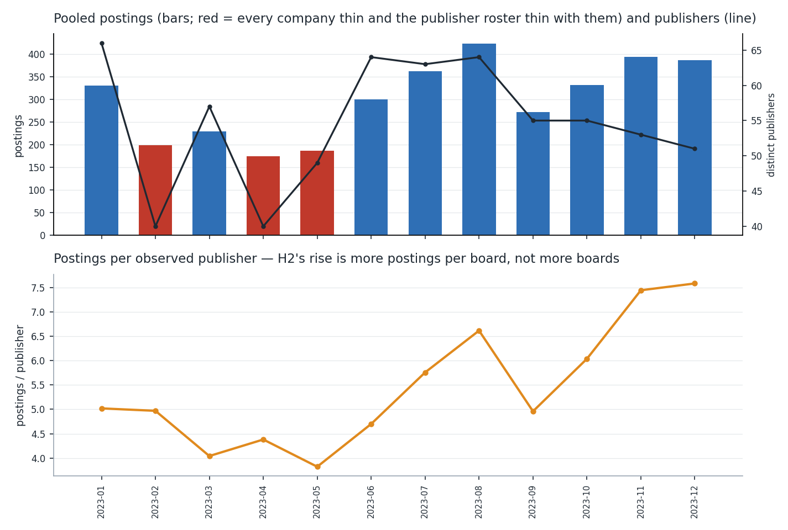
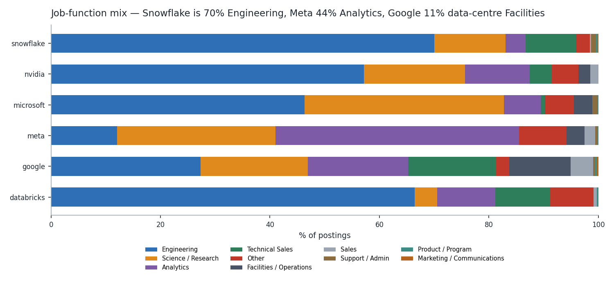
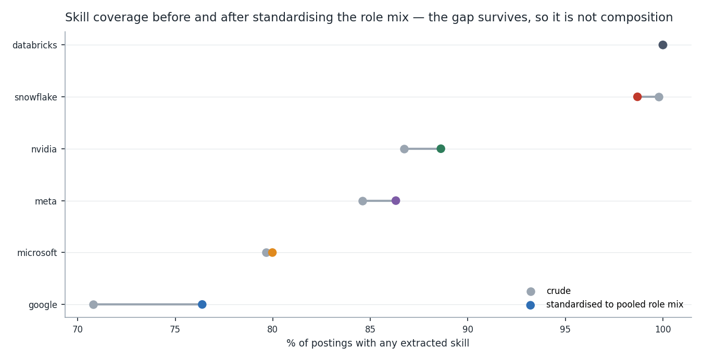
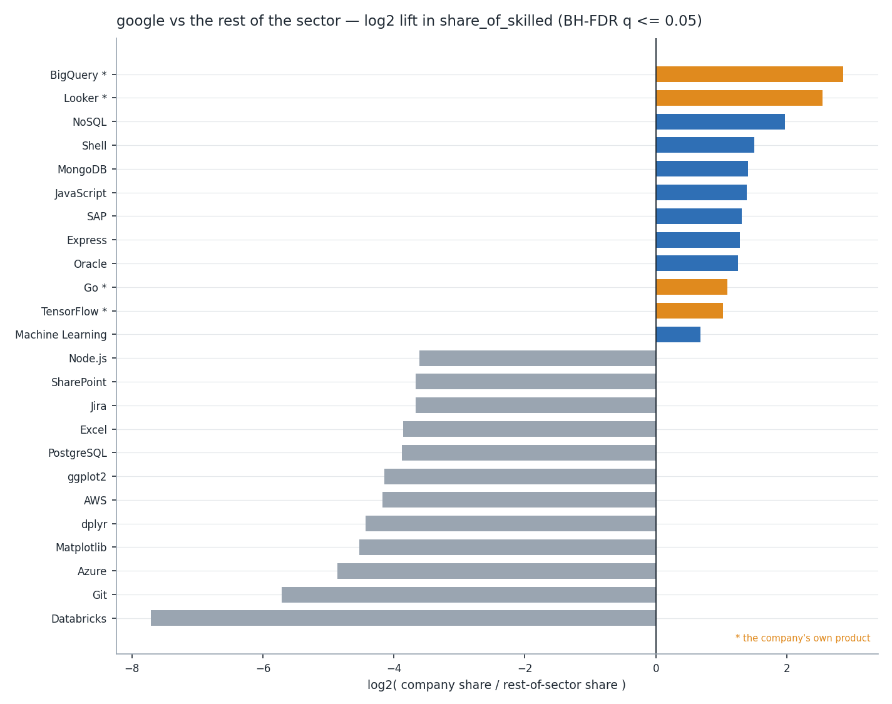
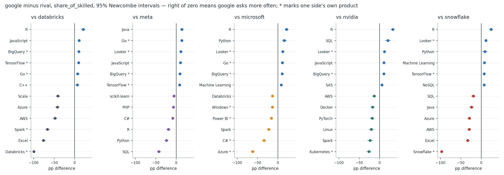

# Task 06 — Competitor Comparison Report (Google)

**Specialist:** Ankit Ranjan · **Company:** Google (Alphabet) · **Date:** 2026-08-10

Input: the six-company competitor set built from the same HF backfill Task 02
collected — **846 Google-family postings** plus 2,751 rival postings, all
2023-01-01 to 2023-12-31. Output: 33 aggregate comparison tables, 9 figures
and a machine-readable evidence report.

- **Method rationale (team standard):** [`docs/task-06-competitor-comparison-methods.md`](../../docs/task-06-competitor-comparison-methods.md)
- **Code:** [`src/companies.py`](../../src/companies.py) · [`src/compare.py`](../../src/compare.py) · [`src/build_competitor_set.py`](../../src/build_competitor_set.py) · [`src/build_comparison.py`](../../src/build_comparison.py)
- **Tests:** [`tests/test_companies.py`](../../tests/test_companies.py) (36) · [`tests/test_compare.py`](../../tests/test_compare.py) (94) — **359 passing** in the suite
- **Machine-readable report:** [`task-06-comparison-report.json`](task-06-comparison-report.json)
- **Tables:** [`task-06-tables/`](task-06-tables/) · **Figures:** [`task-06-figures/`](task-06-figures/)

```bash
python src/build_competitor_set.py
python src/build_comparison.py
python -m pytest tests/ -q
```

**Every number below is within-2023, from a single collection window and a
single upstream dataset.** None of it is a claim about how these six companies
hire in any other year, and none of it is a claim about hiring — only about
postings we can see.

---

## 1. Google against five rivals — and the count changed

The brief gives Ankit = Google and leaves the other three seats `_TBD_`, so
this task had to build its own comparison set. Eight candidates were screened;
six passed:

| Company | Postings | Publishers | Countries | Verdict |
| --- | --- | --- | --- | --- |
| Meta | 1,026 | 102 | 32 | included |
| **Google** | **846** | **95** | **46** | included |
| Microsoft | 654 | 88 | 50 | included |
| Snowflake | 460 | 37 | 28 | included |
| Databricks | 340 | 39 | 18 | included |
| NVIDIA | 271 | 43 | 25 | included |
| OpenAI | 14 | 6 | — | excluded (7/12 months) |
| Anthropic | 9 | 5 | — | excluded (4/12 months) |

The two exclusions are a **published finding, not a dropped row**
([`company-feasibility-screen.csv`](task-06-tables/company-feasibility-screen.csv)).
In this feed OpenAI and Anthropic are effectively invisible in 2023 — 14 and 9
postings. Any "AI-lab hiring boom" narrative built on this dataset would be
built on 23 postings.

Google's 846 come from eight brands: Google (741), Waymo (51), Verily (38),
YouTube (6), Google Operations Center (3), Google Fiber (3), DeepMind (3),
Mandiant (1). Zero unmapped source terms.

**And the count is 846, not the 848 Tasks 02–05 reported.** Making "which
employer strings are Google?" an explicit, tested rule
([`employer-matching-audit.csv`](task-06-tables/employer-matching-audit.csv))
caught two rows earlier tasks counted: a `named_third_party` and a
`role_string`. The consequence is narrow — the raw December index moves
91.11 → 92.13, and the balanced, chained and bilateral indices do not move at
all. Recorded as
[C4](../../docs/corrections.md#c4--googles-posting-count-is-846-not-848);
Tasks 02–05 keep their wording and their 848.

---

## 2. "Who posts more?" is not a question this data answers

Task 05 established that Google's own volume direction is not identified
because publisher coverage moves. Comparing across companies makes that worse,
because each company sits in a **different** set of publishers.

Before comparing anything, `comparability_report()` checks whether the
companies share enough channel to be compared at all
([`company-comparability.csv`](task-06-tables/company-comparability.csv)):

| Company | Common-panel share | Own-channel share | Top publisher |
| --- | --- | --- | --- |
| NVIDIA | 67.5% | 0.0% | via Trabajo.org (26.9%) |
| Microsoft | 60.9% | 7.0% | via LinkedIn (24.6%) |
| **Google** | **54.1%** | **6.7%** | **via LinkedIn (25.3%)** |
| Databricks | 53.8% | 0.0% | via LinkedIn (30.6%) |
| Meta | 44.0% | 4.3% | via BeBee (12.9%) |
| Snowflake | **23.5%** | **45.7%** | via Snowflake Careers (45.2%) |

Snowflake falls below the 40% floor: nearly half its postings arrive through
its own careers page, which no other company's feed contains. So
`level_identified = False` — **cross-company posting levels are not
identified**, and the number "Google posted 846 and Snowflake 460" is a
statement about syndication, not about demand.



Only **7 publishers** carry all six companies across the window, never more
than 3 within a single month, and **none at all in February**. That is the
whole comparable surface.

---

## 3. What *is* answerable: Google lost share of the shared pool

Levels are not identified, but a **relative share** is. Inside the common
panel, each company's share of the pooled postings differences out whatever
the publishers did to everyone at once. H1 vs H2
([`relative-share-by-half.csv`](task-06-tables/relative-share-by-half.csv),
panel totals 620 → 1,161):

| Company | H1 share | H2 share | Change | log |
| --- | --- | --- | --- | --- |
| NVIDIA | 8.06% | 11.46% | +3.40 pp | +0.347 |
| Databricks | 8.39% | 11.28% | +2.89 pp | +0.293 |
| Microsoft | 19.03% | 24.12% | +5.09 pp | +0.237 |
| Meta | 24.52% | 25.75% | +1.23 pp | +0.050 |
| **Google** | **28.87%** | **24.03%** | **−4.84 pp** | **−0.182** |
| Snowflake | 11.13% | 3.36% | −7.77 pp | −1.190 |

**Google is still the second-largest presence in the shared pool, and its
share fell.** Google's own panel count rose (179 → 279 postings); everyone
else's rose faster.

> **Corrected by Task 07 —
> [C5](../../docs/corrections.md#c5--task-06s-h1-aggregate-counts-february-on-a-panel-that-does-not-exist-in-february).**
> 97 of the 620 H1 postings are February's, on a panel §2 of this report says
> carries "none at all in February". Excluding February, Google's decline is
> **−6.56 pp**, not −4.84, and every sign in the table above is unchanged. The
> wording here stays as submitted — see the register.

That is one estimate, and the identifying assumption — that Google's
propensity to syndicate through these publishers is the same in both halves —
is not testable directly. What is testable is whether the result holds
publisher by publisher. Recomputed inside each of the 6 tested publishers,
Google's decline appears in **4 of 6**, so the verdict is `mixed`
([`relative-share-verdict.csv`](task-06-tables/relative-share-verdict.csv)).
**Only NVIDIA is `confirmed`** (6/6). Everything else in that table — Google
included — is directional, not settled.



> **The claim to carry forward:** *within 2023, on the seven publishers that
> carry all six companies, Google's share of the shared pool fell 4.84 pp
> (H1→H2), a direction that holds in 4 of 6 publishers.* Not "Google's hiring
> slowed."

---

## 4. It is not the crawler

All six companies are thicker in H2 than H1
([`half-over-half.csv`](task-06-tables/half-over-half.csv)) — Google raw
+25.0%, balanced +56.5%, and raw/balanced **agree in sign for all six**. Six
companies moving together is the signature of a collection artefact, so it has
to be ruled out before §3 means anything.

It is ruled out by the roster
([`collection-artefact-check.csv`](task-06-tables/collection-artefact-check.csv)):
across the window the publisher roster **shrank** 66 → 51 while density rose
5.02 → 7.59 postings per publisher. A crawler ramp adds publishers; this feed
lost them and got thicker on the survivors. Mean pairwise monthly correlation
between companies is 0.318 — co-movement, not lockstep. Three months are thin
for everyone (February, April, May), February being the same coverage gap
Task 05's C1 recorded.



---

## 5. Google's postings are shaped differently from everyone's

Companies are not comparable role-for-role. Total-variation distance between
job-function mixes
([`job-function-mix-distance.csv`](task-06-tables/job-function-mix-distance.csv))
runs 0.135 to 0.678 across the 15 pairs, mean 0.378. Google's distances:

| vs | Databricks | Snowflake | Meta | Microsoft | NVIDIA |
| --- | --- | --- | --- | --- | --- |
| Google | 0.447 | 0.435 | 0.418 | 0.394 | 0.323 |

Google is far from every one of them and closest to NVIDIA. The single biggest
driver is that **11.2% of Google's postings are Facilities / Operations**,
against ≤3.4% for every rival (Databricks and Snowflake: zero). That is why
every skill share below is `share_of_skilled` with Facilities/Operations
excluded from the denominator, and why every headline share is also published
**directly standardised** to a pooled role mix.



---

## 6. Google has the lowest skill coverage of the six — and it is real

| Company | Crude | Standardised | Mix effect |
| --- | --- | --- | --- |
| Databricks | 100.0% | 100.0% | 0.00 pp |
| Snowflake | 99.8% | 98.7% | +1.08 pp |
| NVIDIA | 86.7% | 88.6% | −1.90 pp |
| Meta | 84.6% | 86.3% | −1.71 pp |
| Microsoft | 79.7% | 80.0% | −0.31 pp |
| **Google** | **70.8%** | **76.4%** | **−5.57 pp** |

Google's role mix costs it 5.57 pp of apparent coverage — the largest mix
effect of the six, and exactly the artefact §5 predicted. But standardising
does not rescue it: at 76.4%, on 99.2% of the pooled weight, **Google is still
last**. 247 of 846 Google postings carry no extractable skill at all.



This is a measurement fact about *our* feed, not about Google's job ads. It
inherits Task 04's channel bias (`via Google Careers` had 19.1% coverage
against 82.6% elsewhere) and Task 03's idle Layer B — the backfill carries no
description text, so skills come from a source field and titles only.
**Google's skill denominator is 590 skilled postings**, and every share in §7
is out of that.

---

## 7. What Google asks for that its rivals do not

48 of Google's skill shares differ significantly from the pooled rest at 5%
FDR ([`skill-distinctiveness-google.csv`](task-06-tables/skill-distinctiveness-google.csv)).
The extremes:

| Skill | Google | Rest | log-lift | |
| --- | --- | --- | --- | --- |
| BigQuery | 10.51% | 1.43% | **+2.863** | own product |
| Looker | 11.86% | 2.02% | **+2.546** | own product |
| NoSQL | 7.97% | 2.02% | +1.976 | |
| Go | 15.93% | 7.50% | +1.089 | Google-origin |
| TensorFlow | 12.03% | 5.94% | +1.021 | Google-origin |
| Machine Learning | 10.34% | 6.49% | +0.677 | |
| R | 36.27% | 27.60% | +0.394 | |
| Spark | 6.10% | 26.76% | −2.116 | |
| scikit-learn | 1.02% | 6.62% | −2.593 | |
| AWS | 0.85% | 16.77% | −4.173 | |
| Azure | 0.85% | 27.01% | −4.860 | |
| Git | **0.00%** | 4.42% | −5.715 | |
| Databricks | 0.00% | 17.74% | −7.713 | |

Head-to-head, Google's skill profile is significantly different from each
rival in 27–41 skills per pair (`google-vs-*-skill-gaps.csv`). Pooling the
five pairs, **exactly one skill is significantly higher at Google against all
five rivals: BigQuery.** Four are significantly lower against all five:
**Azure, Spark, Git, scikit-learn**.




Two readings that are *not* supported:

- **"Google doesn't use Git."** Zero of 590 skilled Google postings mention it
  while rivals average 4.4%. A company of Google's size does not have zero Git.
  This is the source's extracted skill list, and a −5.715 log-lift on a
  literal zero is a measurement artefact wearing a statistic's clothes.
- **"Google is anti-cloud."** AWS and Azure at 0.85% are rivals' clouds. GCP
  is not in this table because it is not distinctive against a pool that
  contains Databricks and Snowflake postings mentioning GCP.

And the stratified check is mandatory, because pooled cross-company gaps are
exactly where Simpson's paradox lives. Of Google's **182** supported pair-skill
comparisons, only **33 are `confirmed`** (same sign in every job function);
**149 are `mixed`** ([`skill-stratified-verdicts.csv`](task-06-tables/skill-stratified-verdicts.csv)).
The confirmed ones are the quotable ones — e.g. Azure vs Microsoft −0.610,
Databricks vs Databricks −0.997, SQL vs Meta −0.429, Python vs Meta −0.236 but
Python vs Microsoft **+0.150**. Google asks for Python less than Meta and more
than Microsoft, in every function of both comparisons.

---

## 8. Google's most distinctive skill is its own product name

The two largest lifts in §7 — BigQuery and Looker — are Google products, and
the third-largest group (Go, TensorFlow) is Google-origin technology. This is
partly circular: a Google posting mentions BigQuery because it is a Google
posting.

The audit ([`self-reference-audit.csv`](task-06-tables/self-reference-audit.csv))
separates the two effects it causes:

- **Coverage inflation is small for Google.** 14.07% of Google postings
  mention a Google product; removing them drops coverage 70.80% → 67.49%,
  **+3.31 pp**. Compare Microsoft (66.5% of postings, +11.62 pp), Databricks
  (99.4%) and Snowflake (99.1%) — for those two the company name is
  essentially the dataset.
- **Ranking dominance is large.** 6 of Google's 48 significant skills are
  self-referential, and they hold the top two slots.

Nothing is filtered. Rows carry `vendor_relation` and `self_referential` so a
reader can discount them; deleting them would delete real signal (a company
genuinely does hire for its own stack).

---

## 9. Channel sensitivity: Google's skill shares are stable

Every skill share is recomputed on the common panel alone and compared
([`skill-panel-robustness.csv`](task-06-tables/skill-panel-robustness.csv)).
Five shares across all six companies shift by more than 10 pp — one Databricks
(Java) and four Snowflake (Azure, C++, Excel, Java), which is what a 23.5%
common-panel share buys you.

**None of Google's 24 tracked shares is channel-sensitive.** The largest move
is Go, 15.93% → 17.71% (+1.78 pp). Google's skill profile is not an artefact
of which boards carry it — a claim §6's coverage gap does not undermine,
because the gap is in *who has any skill at all*, not in *which skills the
skilled ones name*.

---

## 10. Limitations

1. **Levels are not comparable** (§2). Snowflake fails the gate; nothing here
   licenses "X posts more than Y."
2. **The comparable surface is 7 publishers**, ≤3 in any month, 0 in February.
   Every cross-company number rests on that.
3. **The relative-share estimate is `mixed` for Google** — 4 of 6 publishers.
   Directional only.
4. **Role mixes are far apart** (§5), so crude shares mislead; use the
   standardised column and the stratified verdict.
5. **Google has the weakest skill coverage** (§6). 247 postings contribute
   nothing to any skill share.
6. **Self-reference is unremovable, only labelled** (§8).
7. **Zero cells are measurement, not absence** (§7, Git).
8. **No country comparison.** Task 05 §5 ruled it unverifiable; Google spans
   46 countries and Databricks 18, so the comparison would be pure coverage.
9. **The rivals have no specialist.** Their brand ladders, exclusions and
   skill lists were built by one person from one registry — [`employer-matching-audit.csv`](task-06-tables/employer-matching-audit.csv)
   exists so the other three specialists can overrule them.
10. **`posting_date` is an ingestion date** (C3), for all six companies.

---

## 11. What Tasks 07–09 inherit

**Task 07 (Demand Forecasting):**
- Forecast **per company on the balanced panel**, never on pooled raw counts.
- The cross-company object that is identified is the **share of the common
  panel**, not the level. If you forecast a level, forecast it as
  share × pool.
- February is missing for the panel entirely — treat as missing, not zero.
- Google's H2 thickening is real but shared by all six (§4); a model that
  reads it as company-specific momentum is fitting the collection.

**Task 08 (Evaluation):**
- Evaluate against the **standardised** shares, and report the crude ones
  beside them; the gap is 5.57 pp for Google alone.
- A skill-level baseline must respect `MIN_CELL = 10` and the FDR-adjusted
  `significant` flag, not raw p-values.

> **Corrected by Task 08 — [C7](../../docs/corrections.md#c7--task-08-is-company-similarity-scoring-not-visualisation-and-not-evaluation).**
> Task 08 is **Company Similarity Scoring**, not Evaluation, and neither
> instruction above survived contact with it. Mix standardisation is published
> as one of four sensitivities, not as the primary object — it is a
> third-order effect (rank correlation 0.90) next to own-product vocabulary
> (0.2989 on one pair). And there is no skill-level baseline to correct:
> Task 08's unit is the **pair**, and its uncertainty is a posting-level
> bootstrap over whole profiles.

**Task 09 (Insight Generation):**
- Every cross-company sentence carries three things: the panel it is measured
  on, the stratified verdict, and whether the skill is self-referential.
- "Google is falling behind Microsoft in cloud hiring" is the sentence this
  task exists to prevent. What is supported: *Google's postings mention Azure
  significantly less than Microsoft's, in every job function* — which is a
  statement about vendors, not about hiring.
- The two headline-worthy findings are **§3** (Google's share of the shared
  pool fell, 4/6) and **§1** (OpenAI and Anthropic are 23 postings — the
  AI-lab story is not in this data).

---

## 12. Deliverables

| Artefact | Path |
| --- | --- |
| Team method standard | [`docs/task-06-competitor-comparison-methods.md`](../../docs/task-06-competitor-comparison-methods.md) |
| Company registry + matching | [`src/companies.py`](../../src/companies.py) |
| Comparison estimators | [`src/compare.py`](../../src/compare.py) |
| Runners | [`src/build_competitor_set.py`](../../src/build_competitor_set.py) · [`src/build_comparison.py`](../../src/build_comparison.py) |
| Tests | [`tests/test_companies.py`](../../tests/test_companies.py) (36) · [`tests/test_compare.py`](../../tests/test_compare.py) (94) — 359 passing |
| Comparison tables (33 CSVs) | [`task-06-tables/`](task-06-tables/) |
| Figures (9 PNGs) | [`task-06-figures/`](task-06-figures/) |
| Evidence report | [`task-06-comparison-report.json`](task-06-comparison-report.json) |
| Correction raised | [C4](../../docs/corrections.md#c4--googles-posting-count-is-846-not-848) |

Aggregate tables and figures are committed; they carry counts, shares,
indices and confidence bounds only. Row-level data for all six companies stays
git-ignored, in this task's own namespace (`data/raw/task-06/`) so that
building the competitor set cannot overwrite an earlier task's input. The
standing Task 01 check `personal_data_columns_present` was re-run over all
**33** tables and is **empty**.
