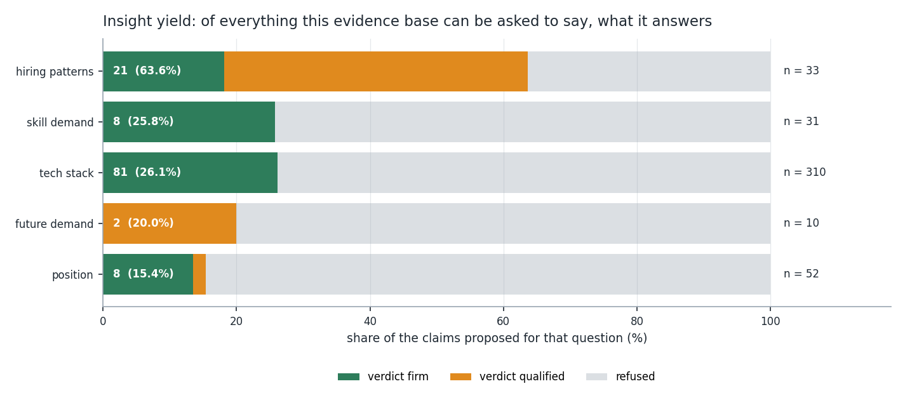
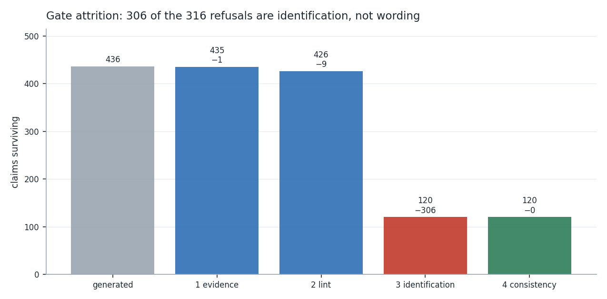
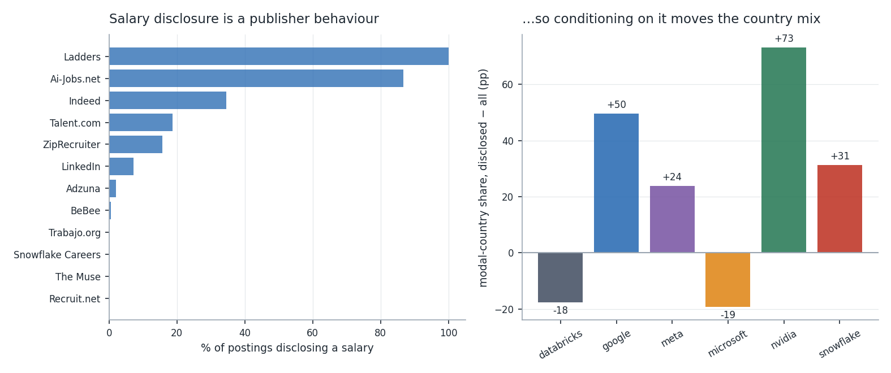
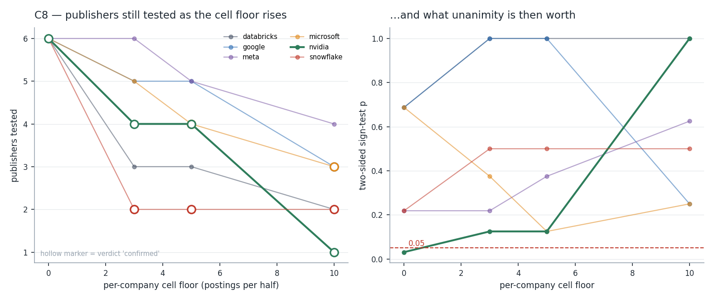
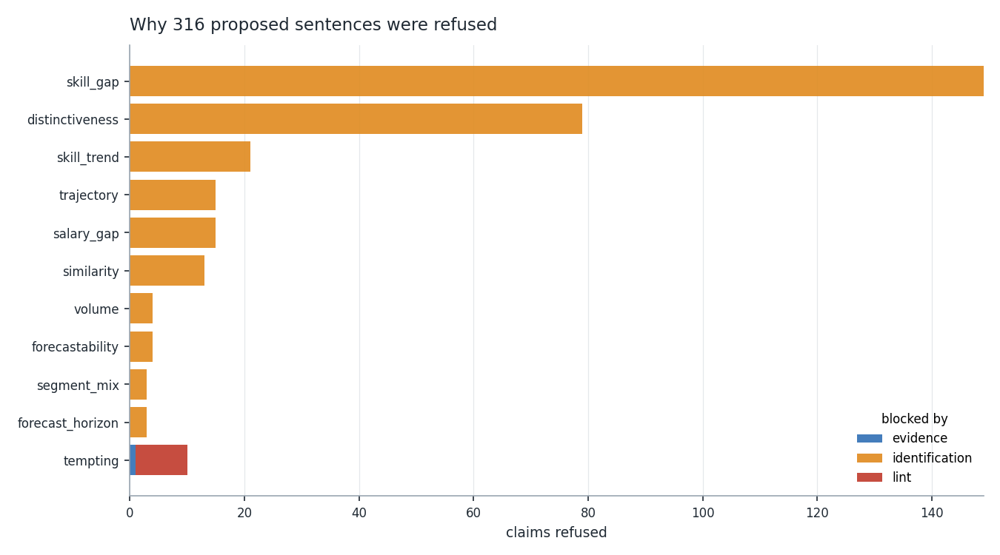
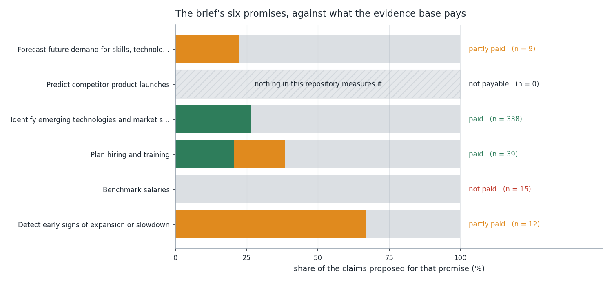
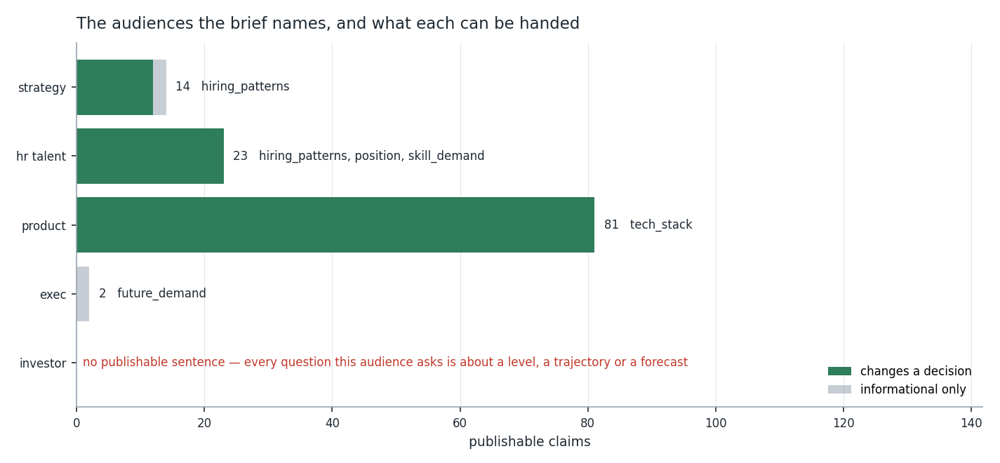

# Task 09 — Insight Generation & Reporting (Google)

**Specialist:** Ankit Ranjan · **Company:** Google (Alphabet) · **Date:** 2026-08-21

Input: every verdict table Tasks 05 to 08 committed, plus one analysis Task 09
performs itself — whether this dataset can benchmark pay. Output: **436
candidate claims, mechanically generated**, put through four gates, of which
**120 may be published**. 25 tables, 8 figures, a machine-readable ledger, and
one correction against Task 06.

- **Method rationale (team standard):** [`docs/task-09-insight-generation-methods.md`](../../docs/task-09-insight-generation-methods.md)
- **Code:** [`src/insights.py`](../../src/insights.py) · [`src/build_insights.py`](../../src/build_insights.py)
- **Tests:** [`tests/test_insights.py`](../../tests/test_insights.py) (72) — **557 passing** in the suite
- **Machine-readable report:** [`task-09-insight-report.json`](task-09-insight-report.json)
- **Tables:** [`task-09-tables/`](task-09-tables/) · **Figures:** [`task-09-figures/`](task-09-figures/)
- **What this task overturned:** [`docs/corrections.md`](../../docs/corrections.md) — [C8](../../docs/corrections.md#c8--a-unanimity-count-is-not-a-robustness-statistic-when-the-number-of-tests-moves-with-the-threshold)

```bash
python src/build_insights.py
python -m pytest tests/ -q
```

**Every sentence below is a row in [`claim-ledger.csv`](task-09-tables/claim-ledger.csv).**
Each carries a citation that resolves to a committed cell, the clause it must
be read with, the observation that would falsify it, and the upstream verdict
that let it through. Nothing in this report was written and then justified.

---

## 1. The headline is the denominator

436 candidate claims were generated — one per row of the upstream verdict
tables, before any of them was looked at. That matters more than the survivors
do: an author who writes insights by hand writes the ones they can support,
and the refusals never take a form anyone can count.

| Question | Generated | Publishable | Yield |
| --- | --- | --- | --- |
| Hiring patterns | 33 | 21 | 63.6% |
| Skill demand | 31 | 8 | 25.8% |
| Tech stack | 310 | 81 | 26.1% |
| Future demand | 10 | 2 | 20.0% |
| Position | 52 | 8 | 15.4% |
| **All** | **436** | **120** | **27.5%** |



**102 of the 120 rest on a firm upstream verdict; 18 publish on a verdict the
upstream task hedged itself.** Separately — and it is a coincidence of this
dataset, not the same number twice — **102 of the 120 are about Google**: 92
firm, 10 qualified. The rest describe the five rivals Task 06 assembled.

Where the 316 refusals go is the part worth reading:

| Gate | Refused |
| --- | --- |
| 1 evidence | 1 |
| 2 lint | 9 |
| 3 identification | **306** |
| 4 consistency | 0 |



**306 of 316 fail on identification.** These are not badly phrased sentences.
They are sentences this evidence base cannot support at any level of care —
149 blocked by a `mixed` verdict, 101 by a `False` flag, 14 by insufficient
support, 13 by an unresolved one, 7 by mix dependence. No amount of careful
writing recovers them, and a report that showed only its survivors would
report a hit rate of 100%.

The one evidence failure and the nine lint failures were planted (§10).

---

## 2. Google's hiring strategy and position, in one paragraph

The brief asks each specialist for "a short explanation of the company's
hiring strategy & position". Here it is, and every clause is cited below.

> Google's 2023 postings describe a company advertising a **distinctive
> platform stack into a market that has standardised on someone else's**. Of
> the 48 skills that separate Google from the other five after FDR control,
> only 14 are ones Google asks for *more* often — four of those are its own
> products (Looker, BigQuery, Go, TensorFlow) — and 34 are skills the field
> asks for more than Google does, led by Azure (−26.2 pp), Spark (−20.7 pp)
> and SQL (−18.0 pp), with two further Google products, GCP (−5.5 pp) and
> Kubernetes (−5.1 pp), on that side as well. Of 33 pair-skill gaps that survive
> stratification by job function, **Google leads 2**: Python against
> Microsoft and Go against Databricks. Inside its own postings the mix moved
> toward Sales (+2.7 pp) and Technical Sales (+2.1 pp) and away from Science /
> Research (−5.4 pp) across 2023, and its share of the shared publisher pool
> fell. Its nearest competitor for talent is **Meta**, at 0.9174 — rank 1 of
> 15 pairs and the only pair in the set that is robust. What cannot be said:
> whether Google posts more or fewer roles than any of them, whether its
> hiring is accelerating, what it pays, or what any of it will do next.

That paragraph draws on three families that publish on a firm verdict — 48
distinctiveness claims, 33 stratified skill gaps, one similarity rank — and
two that publish only qualified: the seven segment-mix shares and the share
move. Its last sentence is four refusals, and they are load-bearing rather
than modest: §6 and §7 are what it costs to write them.

---

## 3. Hiring patterns: the mix moved, the volume is unreadable

Twenty-one of 33 hiring-pattern claims publish, the best yield of the five
questions — and 15 of the 21 publish on a *qualified* verdict, which is the
same fact seen from the other side.

**What publishes firm.** Panel structure. Google's postings arrive through 95
publishers, of which the common six-company panel carries 54.1%
([`company-comparability.csv`](task-06-tables/company-comparability.csv)).
That is a fact about the aggregator, and its action is procedural: scope every
cross-company read to the common panel.

**What publishes qualified.** Seven job-function shares, from Task 05's
balanced panel:

| Function | H1 → H2 | Change |
| --- | --- | --- |
| Sales | 2.6% → 5.3% | **+2.66 pp** |
| Technical Sales | 15.1% → 17.2% | **+2.08 pp** |
| Product / Program | 0.3% → 0.4% | +0.15 pp |
| Support / Admin | 0.3% → 0.4% | +0.15 pp |
| Facilities / Operations | 11.1% → 11.2% | +0.11 pp |
| Marketing / Communications | 0.3% → 0.2% | −0.06 pp |
| Science / Research | 22.6% → 17.2% | **−5.35 pp** |

Each carries the clause *a share can move because a different function moved*
— which is not boilerplate here, since these seven sum to roughly zero by
construction. The Science / Research fall and the Sales rise are the same
event described twice.

**And the share claim, which is where C8 came from.** Google was losing share
of the shared publisher pool between the halves of 2023 — log share change
−0.182, agreeing in 4 of 6 publishers. It publishes qualified, with two
clauses: *share of a fixed publisher pool, not headcount and not absolute
volume*, and *unanimity here is floor-dependent, see C8*. Its falsifier is the
recount §9 performs.

Absolute volume remains where Task 05 left it: **not identified.** Google's
own volume claim is generated and refused — its 2023 postings read as growth,
but the four panel treatments spread **99.05 index points** around that
reading, so the direction is a property of the treatment, not of the company
([`volume-verdict.csv`](task-06-tables/volume-verdict.csv)).
Only Meta's and Snowflake's volume claims publish, both qualified and both
explicitly scoped to the shared panel. A count of Google's postings is a count
of the boards that syndicated them.

---

## 4. Skill demand: eight trends, and one that reads like a typo

Eight of 31 skill-trend claims publish, all on a firm verdict — the skills
whose direction holds inside *every* job function tested.

| Skill | Direction | Pooled H1 → H2 | Functions |
| --- | --- | --- | --- |
| SQL | rising | 0.3180 → 0.5059 | 5 |
| R | rising | 0.3295 → 0.3794 | 3 |
| Machine Learning | rising | 0.0958 → 0.1088 | 3 |
| Go | falling | 0.2222 → 0.1118 | 2 |
| Java | falling | 0.2605 → 0.1912 | 2 |
| Scala | falling | 0.1226 → 0.0647 | 2 |
| JavaScript | falling | 0.1379 → 0.1118 | 2 |
| Looker | falling | 0.0920 → **0.1382** | 3 |

The Looker row is not a typesetting error and it is the most instructive line
in the table. Looker falls inside all three functions that carry it *while the
pooled share rises* — a Simpson's reversal, and the exact shape of
[C2](../../docs/corrections.md#c2--five-of-task-04s-ten-headline-skill-movers-do-not-survive-stratification),
where Task 04 called Looker an emerging skill on the pooled number alone.

The claim compiler generated that sentence with the direction word from the
stratified verdict and the numbers from the pooled columns, and the result read
as a contradiction a reader would resolve in favour of the numbers — which
would have re-committed C2 inside the task that exists to prevent it. The
sentence now names the reversal, and the clause says the pooled figure *does
not overrule* the within-function direction. `test_a_reversed_skill_trend_names_the_reversal`
pins it.

Fourteen skills refuse on insufficient support and seven on mix dependence.
Those seven — Python, BigQuery, Linux, C++, TensorFlow, Tableau, MATLAB — are
the rest of C2's casualty list, and they are still refused three tasks later.

---

## 5. Tech stack: 81 sentences, and what they say

This is the question with the most to say, and the only place a reader gets a
large body of publishable text: **81 claims, all on a firm verdict.**

**48 distinctiveness claims** — skills that separate Google from the pooled
other five after Benjamini–Hochberg control across the whole 127-skill
vocabulary. The direction of those 48 is the finding:

| | Count | Largest |
| --- | --- | --- |
| Google asks **more** | 14 | Looker +9.8 pp, BigQuery +9.1 pp, R +8.7 pp, Go +8.4 pp |
| Google asks **less** | 34 | Azure −26.2 pp, Spark −20.7 pp, Excel −19.5 pp, SQL −18.0 pp |

Six of the 48 are Google's own products, and each of the six carries the
clause *this is the company's own product, so the mention is self-referential*
— Task 07's self-reference rule, enforced at the sentence level rather than
trusted to the writer. Four of them (Looker, BigQuery, Go, TensorFlow) sit on
the positive side, which is the expected shape. **Two do not: GCP at −5.5 pp
and Kubernetes at −5.1 pp.** Google names its own cloud platform in a smaller
share of its skilled postings than the other five name it in theirs. Whatever
that is, it is not a demand signal about GCP, and the self-reference clause is
there so nobody reads it as one.

**33 skill-gap claims** — pooled differences that hold in *every* job function
tested, against a named rival rather than the pool. Google leads two of the
33:

- Google asks for **Python** in a larger share of its skilled postings than
  Microsoft does, by 0.1497 pooled, holding in 4 of 4 job functions.
- Google asks for **Go** in a larger share of its skilled postings than
  Databricks does, by 0.0806 pooled, holding in 5 of 5 job functions.

The other 31 run against it — Microsoft leads 12, Databricks 7, Snowflake 5,
Meta 4, NVIDIA 3. Every one carries *a stack difference, not a capability
difference*.

Read together with §4: SQL is Google's fastest-rising skill inside job
function and simultaneously the fourth-largest deficit against the field.
Those are not in tension. One is a trajectory inside Google, the other is a
level against rivals, and the dataset identifies both because both are shares
of skilled postings within matched strata.

---

## 6. Position: available as a profile, refused as a level and as a trajectory

Eight of 52 position claims publish — the lowest yield of the five questions,
and the one where the refusals carry more than the survivors
([`strategy-position.csv`](task-09-tables/strategy-position.csv)):

**Available.** Position as a *profile*. 48 skills separate Google from the
other five after FDR control, and its nearest neighbour is Meta at 0.9174,
`robust` — rank 1 in 100% of resamples, under all five metrics, after dropping
own products and after standardising role mix. Google–NVIDIA publishes at rank
2 but only as `published_qualified`: Task 08 marked it `vendor_dependent`,
because dropping own products moves that rank seven places.

**Refused — level.** A posting count is a count of the boards that syndicate
it. `cross_company_level` is a lint rule as well as a verdict, so a sentence
like "Google posts more roles than Snowflake" is blocked before it reaches the
identification gate.

**Refused — trajectory.** Task 08 found 1 of 15 pairs eligible and its mean
correlation inside the closure null. Task 09 reads that verdict as
`eligible & excludes_zero`, and all 15 pairs refuse. Reading `excludes_zero`
alone would have published two of them — the two whose interval excludes zero
*while being ineligible* — which is the defect
`test_conjunction_inherits_the_weakest_verdict` exists to stop.

The other six position claims are the salary-disclosure rates, and §8 is why
they say less than they appear to.

---

## 7. Future demand: two sentences, neither of them a forecast

Ten future-demand claims were generated and two publish — Google's and
Meta's — both on a qualified verdict, and neither of them forward-looking.

> Google's monthly share series carries **73.9% signal**, enough to be worth
> modelling.

Clause: *passing the forecastability gate means the series is not pure noise;
it does not mean a forecast is usable.* Action: **none on its own — the
horizon table decides usability.** Four of the 120 carry an action of that
kind (these two, and Meta's and Snowflake's volume readings), and they are
kept rather than dropped: for the exec audience these two *are* the corpus,
and deleting them would replace an honest "nothing to do here" with a silence
that reads like an oversight.

Everything else refuses. Task 07's horizon table is read as
`interval_sufficient & supported`, and `supported` is False on every forecast
row. Reading `interval_sufficient` alone would have published horizons 1 and
2, contradicting Task 07's own headline that the **maximum useful horizon is
0**.

The brief's first promise — "forecast future demand for skills, technologies
and roles" — is therefore **partly paid**: 0 of 9 claims rest on a firm
verdict, 2 publish on a qualified one, 7 refuse.

---

## 8. Salary benchmarking is refused, and this task did the work to say so

"Benchmark salaries" is the one promise no earlier task had closed, so Task 09
tested it. It fails, and it fails in a way worth six paragraphs because the
failure is invisible from the summary statistics.

**Disclosure is a publisher behaviour, not a company one.** Google discloses a
salary in **4.02%** of its 846 postings — 34 of them. By publisher, disclosure
runs from **100%** (Ladders, Relocation Jobs, JobServe) through 86.8%
(Ai-Jobs.net) and 34.5% (Indeed) to **0%** (The Muse, Trabajo.org, Recruit.net,
and every company careers page).

**Conditioning on disclosure moves the population.** Google's postings are
27.0% US overall and **76.5% US** among those disclosing pay — a 49.5 pp
shift. NVIDIA's disclosed subset is 100% US against 26.9% overall, and
Databricks' and Microsoft's move the *other* way. A company median computed on
this column is a median for a different population than the report is about,
and a different one for each company.



**Compare inside a publisher and one gap survives.** At a 5-salary floor, three
publishers carry two or more companies. That gives Google three pairs:

| Pair | Publisher | Median difference | 95% CI |
| --- | --- | --- | --- |
| Google − Databricks | Ai-Jobs.net | **+$61,976** | [35,628, 75,800] |
| Google − Snowflake | Ai-Jobs.net | +$3,577 | [−13,674, 22,775] |
| Google − Meta | Ladders | −$15,000 | [−25,000, 37,500] |

**Then stratify by job function and it disappears.** Two cells in the whole
dataset are testable, and neither identifies a difference:

- Google–Snowflake, Science / Research, 7 v 7 → **$0** [−7,847, 15,000].
- Google–Meta, Science / Research, 15 v 11 → −$25,000 [−25,000, 50,000].

The Google–Databricks pair — the only one that excluded zero — has **no
testable stratum at all.** Where Google is thick, Databricks is thin (Science /
Research 7 v 2); where Databricks is thick, Google is absent (Engineering
2 v 14, Technical Sales 0 v 12). Google's postings on that publisher are 70.0%
Science / Research; Databricks' are 42.4% Engineering. **The $62,000 was one
role mix priced against a different role mix.**

**Verdict: refused.** All 15 salary-gap claims refuse. What publishes is six
disclosure rates, one per company, each clause-bound as *a property of the
publishers this company appears on, not of its pay policy* — and they are
deliberately excluded from the promise audit, because they say who discloses
pay, not what anyone pays. A promise is settled by the family that answers it,
never by an adjacent family that survived.

---

## 9. C8 — the correction this task raises against Task 06

Task 06 §2 reported publisher sign agreement for each company's H1→H2 share
move, and called unanimity `confirmed`:

> One company clears it. **NVIDIA gained share of the shared pool in every
> publisher that carries it** — the single cross-company volume finding in this
> task that is not qualified into uselessness.

The floor in that function applies to the publisher's total across all six
companies, not to the company's own cell, so a publisher holding one NVIDIA
posting in each half casts a full vote. Recount with a per-company floor
([`publisher-cell-floor.csv`](task-09-tables/publisher-cell-floor.csv)):

| Company | Verdict at floor 0 | Floors confirmed | Publishers tested |
| --- | --- | --- | --- |
| databricks | mixed | none | 6 → 2 |
| **google** | mixed | **10** | 6 → 3 |
| meta | mixed | none | 6 → 4 |
| **microsoft** | mixed | **5, 10** | 6 → 3 |
| nvidia | confirmed | 0, 3, 5, 10 | 6 → 1 |
| **snowflake** | mixed | **3, 5, 10** | 6 → 2 |



**Google itself becomes `confirmed` at a floor of 10** — on three publishers
instead of six. Three of the six companies gain confirmation by discarding
tests, which is the whole correction: a statistic that improves as evidence is
removed is not measuring robustness.

Under a two-sided exact sign test, unanimity across *n* publishers gives
p = 2/2ⁿ, so **six is the smallest panel on which unanimity can reach 0.05 at
all**. Every confirmation gained above is gained on 2, 3 or 4 tests. NVIDIA
never flips, but its test set falls 6 → 1 and its p runs 0.0312 → 0.1250 →
0.1250 → 1.0000; it is the only company clearing 0.05 at floor 0, and only
while single-posting cells vote.

**Pooled directions are identical at every floor for all six companies.** C8
corrects the confirmation, not the finding. Google still lost share; NVIDIA
still gained. What is withdrawn is Task 06's claim to have one unqualified
cross-company volume sentence — there is now none, and all six relative-share
claims publish as `published_qualified`.

Registered as
[C8](../../docs/corrections.md#c8--a-unanimity-count-is-not-a-robustness-statistic-when-the-number-of-tests-moves-with-the-threshold),
marked in place in both Task 06 documents, and checked against the committed
tables by `tests/test_corrections.py`.

---

## 10. The rules that had to fire, and the promises that did not pay

**Nine prohibited patterns, all nine exercised.** Every templated claim in §3
to §8 is clean by construction, so on the first run the linter caught nothing
— and a gate that never fires is an untested gate, not a well-behaved corpus.
Ten sentences a reader would actually want are generated on purpose, one per
rule plus one whose number is right and direction wrong. All ten refuse:

| Rule | The sentence it blocks | Source |
| --- | --- | --- |
| `forecast` | a forward-looking sentence at any horizon | task-07 §8 |
| `convergence` | "Google and Meta are converging" | task-08 §8 |
| `cross_company_level` | "Google posts more roles than X" | task-06 §1.3 |
| `product_launch` | "hiring for X suggests a launch" | task-09 §5 |
| `unmeasured_construct` | headcount, attrition, revenue, budget | task-02 scope |
| `bare_share_of_all` | "30% of all postings mention X" | task-04 §7 |
| `seasonal` | any month-of-year seasonality claim | task-05 §6 |
| `causal_strategy` | "Google is pivoting to X" | task-05 §1 |
| `country_split` | any country figure | task-05 §9 |



**The brief's six promises**
([`brief-promises.csv`](task-09-tables/brief-promises.csv)):

| Promise | Status | Basis |
| --- | --- | --- |
| Identify emerging technologies and market skill gaps | **paid** | 89 of 338 publish firm |
| Plan hiring and training | **paid** | 8 firm, 7 qualified of 39 |
| Forecast future demand | partly paid | 0 firm, 2 qualified of 9 |
| Detect early expansion or slowdown | partly paid | 0 firm, 8 qualified of 12 |
| Benchmark salaries | **not paid** | all 15 refused (§8) |
| Predict competitor product launches | **not payable** | 0 generated |



The last row is a different kind of answer and the figure keeps it separate. A
promise with a zero *numerator* failed a test; a promise with a zero
*denominator* was never testable. Nothing in this repository measures a
product decision, so there is no version of that analysis that could fail —
only one that is never checked. It is also a lint rule, because the sentence is
easy to write and reads as the most valuable output in the report.

**Cross-task consistency: 0 failures.** Three quantities are quoted by two
tasks with different values — Google's H1→H2 change is −4.84 pp in Task 06 and
−6.5617 pp in Task 07 — and all three are
[C5](../../docs/corrections.md#c5--task-06s-h1-aggregate-counts-february-on-a-panel-that-does-not-exist-in-february).
The later value wins, and no claim in the ledger quotes a superseded one.

---

## 11. Who can be handed what — and the audience that gets nothing

Every claim declares an audience and an action. The four whose action begins
"none" are counted informational rather than actionable, so the second column
below is not just a restatement of the first
([`actionability.csv`](task-09-tables/actionability.csv)):

| Audience | Claims | Actionable | Questions covered |
| --- | --- | --- | --- |
| Product managers | 81 | 81 | tech stack |
| HR & Talent | 23 | 23 | hiring patterns, position, skill demand |
| Strategy | 14 | 12 | hiring patterns |
| CEOs & CTOs | 2 | 0 | future demand |
| **Investors** | **0** | **0** | — |



The brief names investors as a beneficiary and this project has nothing for
them. That is structural, not a gap more work would close: the questions an
investor asks of a competitor are *is it bigger*, *is it growing*, *where is
it heading* — a level, a trajectory and a forecast. Task 06 refused the first,
Task 08 the second, Task 07 the third. Handing that reader an assembled
sentence would mean handing them one of the 306.

The distribution is also lopsided in a way the brief did not anticipate: 81 of
120 sentences go to product managers, because the skill vocabulary is large and
skill-level questions are the ones this data answers. Strategy and HR get 37
between them. Executives get two, and neither of the two carries an action.

**Provenance** ([`claim-provenance.csv`](task-09-tables/claim-provenance.csv)):
95 claims come from Task 06's tables, 15 from Task 05, 6 from Task 09's own
salary audit, 2 from Task 07 and 2 from Task 08. The two forecasting tasks
between them contribute 4 of 120 — which is what "the maximum useful horizon
is 0" costs, counted in sentences.

---

## 12. Limitations

1. **The compiler cannot refuse a sentence nobody generated.** The 436
   candidates are one per row of the committed tables. A question no table
   addresses produces no claim and no refusal, and is invisible in the yield.
   Product launches are handled explicitly for that reason; other gaps may
   exist and would not show here.
2. **The lint rules are regexes over English.** They catch the ten phrasings
   §10's table exercises, and no more than that. Two holes were found and
   closed while writing this task — `cross_company_level` matched "more jobs
   than" but not "more roles than"; `bare_share_of_all` matched the column
   name but not "30% of all postings" — which is evidence there were holes,
   not that there are none left. The mitigation is not the regex: it is that
   the published corpus is generated from tables rather than written.
3. **`VERDICT_MAP` embeds judgement in one place.** Mapping
   `vendor_dependent` to `published_qualified` rather than `refused` is a Task
   09 decision, not an inherited one. It is auditable, and it is why
   Google–NVIDIA appears at all.
4. **The salary intervals are percentile bootstraps on medians at n = 7–38.**
   They are wide, asymmetric, and should be read as a feasibility check. The
   §8 refusal does not depend on them — it depends on the missingness pattern
   and the empty strata.
5. **Everything inherits the scope of Tasks 02 and 06:** one year, one
   collection window, six companies, and postings seen through aggregators.
6. **"Publishable" is not "true".** It means four gates passed and an upstream
   task took responsibility for the verdict. Task 06's `confirmed` labels
   passed those gates for three tasks before §9 recounted them.

---

## 13. What Task 10 inherits

Task 10 is the final presentation, and it is the first task in this project
whose output is not checkable by a test. So:

1. **[`claim-ledger.csv`](task-09-tables/claim-ledger.csv) is the source of
   every sentence on every slide.** A number on a slide that is not in that
   table is a number nothing checked. The `sentence()` renderer emits text and
   clause together, joined by an em dash, for exactly this.
2. **The refusals are content.** "No forecast is supported at any horizon",
   "there is no pay benchmark in this data", "there is no sentence here for an
   investor" are among the most decision-relevant outputs this project has,
   and they are the first things a deck drops. §10's promise table and §11's
   audience table are both designed to be shown, not summarised.
3. **`published` does not mean uncaveated.** All 120 carry a clause; the status
   grades the *upstream verdict*. Rendering text without clause publishes a
   different claim from the one that passed the gates.
4. **C8 travels with any NVIDIA or Google share sentence.** Task 06 §11 handed
   this task one unqualified cross-company volume sentence. There is none.
5. **The four figures worth showing are 01 (yield), 03 (audience reach), 05
   (salary missingness) and 06 (promises).** 02, 04, 07 and 08 are audit
   figures — correct, and duller than the tables they summarise.
6. **Google's paragraph is §2**, already written to be quoted whole.

And the standing lesson in the form it takes here: **a handover section is a
prediction, not an instruction**
([C7](../../docs/corrections.md#c7--task-08-is-company-similarity-scoring-not-visualisation-and-not-evaluation)).
This one is no exception. Read the brief before reading §13.

---

## 14. Deliverables

| Item | Path |
| --- | --- |
| Method rationale (team) | [`docs/task-09-insight-generation-methods.md`](../../docs/task-09-insight-generation-methods.md) |
| This report | `members/ankit-google/task-09-insight-report.md` |
| Machine-readable report | [`task-09-insight-report.json`](task-09-insight-report.json) |
| Claim ledger (436 rows) | [`task-09-tables/claim-ledger.csv`](task-09-tables/claim-ledger.csv) |
| Tables (25) | [`task-09-tables/`](task-09-tables/) |
| Figures (8) | [`task-09-figures/`](task-09-figures/) |
| Correction registered | [C8](../../docs/corrections.md#c8--a-unanimity-count-is-not-a-robustness-statistic-when-the-number-of-tests-moves-with-the-threshold) |
| Tests | [`tests/test_insights.py`](../../tests/test_insights.py) (72 of 557) |

Row-level data stays git-ignored. All 25 tables pass the forbidden-column and
personal-data checks before they are written (`privacy.passed` in the JSON),
including the standing check that no emitted column name contains
`candidate` — which this task tripped on its own vocabulary and fixed by
moving the vocabulary, not the check.
