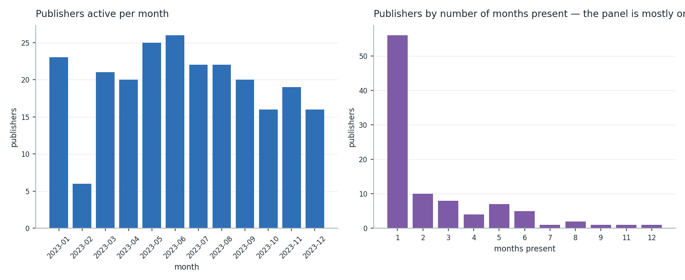
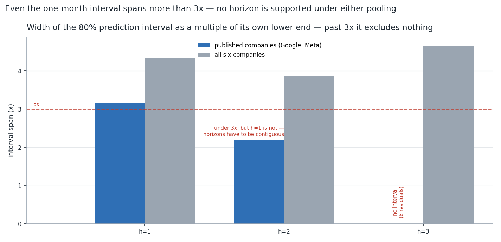
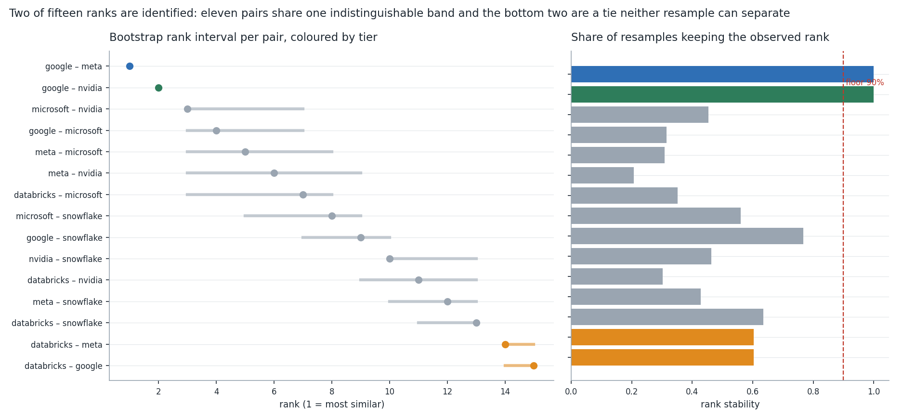
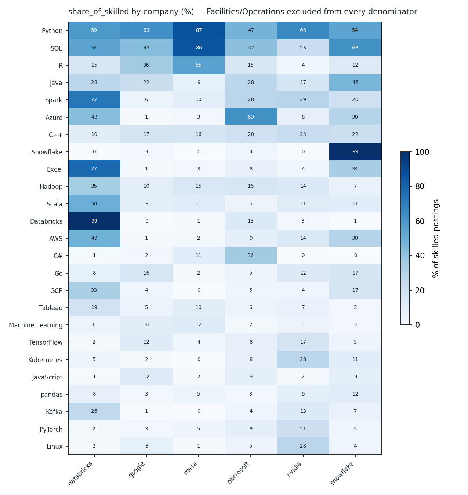

# Task 10 — Final Presentation (Google)

One deck, built from the claim ledger rather than written alongside it. Every bullet below is one of four kinds, and each kind is checked differently:

- **claim** — reproduced character for character from a published row of [`task-09-tables/claim-ledger.csv`](task-09-tables/claim-ledger.csv), so its qualifying clause cannot be dropped on the way to a slide.
- **refusal** — a sentence this project declines to make, quoted with the gate that stopped it.
- **fact** — a template over the repository, with the numbers recomputed at build time. No number is typed here.
- **narration** — prose, and it may carry no numeral beyond a task number, a section mark or the collection year.

The slot order is the team standard in [`docs/task-10-final-presentation-methods.md`](../../docs/task-10-final-presentation-methods.md); the checks are in [`src/present.py`](../../src/present.py) and [`tests/test_presentation.py`](../../tests/test_presentation.py).

---

## Slide 1 — Competitor Demand Prediction Using Job Postings

*Section: `title`*

- Ankit Ranjan — specialist for Google, one of four company seats feeding one shared model.
- Google: 846 postings, 95 publishers, 12 months of 2023.
- 12 tasks, 138 committed tables, 54 figures, 746 tests.

**Notes.** Open on the constraint, not the result: this is a single year from a single aggregator, and that decides what the rest of the talk is allowed to claim.

---

## Slide 2 — Job postings are a forward-looking signal

*Section: `problem`*

- The brief: forecast competitor demand, skill trends and market direction from public job postings.
- A posting states intent before a hire reaches any financial report — that is the whole appeal.
- A posting is also a document a job board chose to syndicate. Everything in this deck turns on that second sentence.

**Notes.** The pitch and the catch on one slide, so nothing later looks like an excuse invented after a null result.

---

## Slide 3 — The legal gate came first, and it removed sources

*Section: `legal`  ·  **mandatory in every deck***

- Task 01 set an API-first source list and a four-pillar checklist: terms of service, robots.txt, public versus copyrighted, and never personal data.
- Google Careers scraping was rejected on robots.txt. It was never collected, and the rejection is committed alongside the approvals.
- Reed was never approved, so it was never called, even though a key sits in the environment file.
- A standing privacy check runs every task: no committed table may carry a column that names a person.

Evidence: [`docs/legal/rejected-sources.md`](../../docs/legal/rejected-sources.md)

**Notes.** The point is that the checklist has teeth — it says no to the single most obvious source for a Google specialist.

**Backed by:** `q-scraping`, `q-privacy`

---

## Slide 4 — What was collected, and what failed the screen

*Section: `data`*

- Google: 846 postings across 95 publishers, present in every one of 12 months.
- Comparison set: 6 companies and 3,605 postings; 2 candidates failed the support screen.
- One source, one year. Every trend sentence here is labelled within-2023, and none of them is a year-on-year comparison.

Evidence: [`task-06-tables/company-feasibility-screen.csv`](task-06-tables/company-feasibility-screen.csv)

**Notes.** Name the two that failed the screen and why — a screen that never excludes anything is decoration.

**Backed by:** `q-sample`

---

## Slide 5 — Rules, not models, so every extraction is inspectable

*Section: `pipeline`*

- Task 03 split preprocessing into a structured layer and a free-text layer. The free-text layer is validated and idle: the API truncates description text, so full-text extraction was never available.
- Task 04 matched 91 distinct skills with rules and aliases rather than a model, so a reviewer can check any single extraction by reading it.
- Skill shares use the skilled-posting denominator, never all postings — the alternative confounds demand with description coverage.

**Notes.** The truncation is the honest reason there is no embedding model here. Say it before the mentor asks why no BERT.

**Backed by:** `q-denominator`, `q-why-rules`

---

## Slide 6 — A posting count is a count of the boards that syndicate it

*Section: `identification`  ·  **mandatory in every deck***

- Google's postings arrive through 95 publishers, of which the common panel carries 54.1% — a property of the aggregator, not of the company's recruiting `[panel-google]`
- So levels do not compare across companies, and the project compares shares of a fixed publisher panel instead.
- February is a collection gap, not a hiring freeze: the publishers that vanish in February come back in March.
- The date field is an aggregator first-seen date, so the weekly series describes discovery, not hiring.

**Notes.** This is the load-bearing slide. If it lands, every refusal later reads as a consequence rather than a hedge. Do not rush it.

**Backed by:** `q-february`, `q-headcount`

---

## Slide 7 — Within-year trends: the mix moves, the volume does not resolve

*Section: `trends`*

- Demand for SQL at Google is rising inside job function, 0.3180 to 0.5059 of skilled postings across 5 segments — share of skilled postings, never of all postings; the direction holds in every segment tested `[skilltrend-sql]`
- Demand for Looker at Google is falling inside every one of the 3 job functions tested, while the pooled share across them runs the other way, 0.0920 to 0.1382 of skilled postings — a Simpson's reversal, and the within-function direction is the identified one — share of skilled postings, never of all postings; the pooled figure disagrees with the within-function direction and does not overrule it `[skilltrend-looker]` *(read from the slide, do not recite)*
- Google's volume direction is not identified: four defensible panel treatments disagree on the sign, so no direction is reported.

**Notes.** Looker is the Simpson's reversal — falling inside every job function while the pooled share rises. It overturned an earlier headline of ours, which is the honest way to introduce the corrections register later.

**Backed by:** `q-direction`, `q-why-shift`

---

## Slide 8 — Share of a common publisher pool, not headcount

*Section: `comparison`*

- Google was losing share of the shared publisher pool between H1 and H2 2023 (log share change -0.182), agreeing in 4 of 6 publishers — share of a fixed publisher pool, not headcount and not absolute volume; unanimity here is floor-dependent, see C8 `[share-google]`
- Nvidia was gaining share of the shared publisher pool between H1 and H2 2023 (log share change 0.347), agreeing in 6 of 6 publishers — share of a fixed publisher pool, not headcount and not absolute volume; unanimity here is floor-dependent, see C8 `[share-nvidia]`
- Unanimity across publishers looks like the strongest evidence on this slide and is the weakest: the number of tests moves with the threshold, see C8.

> **Carries C8.** This slide may not be shown without it — see [`docs/corrections.md`](../../docs/corrections.md).

**Notes.** Expect the mentor to like the unanimous count. Volunteer C8 before they do.

**Backed by:** `q-who-is-biggest`

---

## Slide 9 — The forecast question has an answer, and it is no

*Section: `forecast`*

- Google's monthly share series carries 73.9% signal, enough to be worth modelling — passing the forecastability gate means the series is not pure noise; it does not mean a forecast is usable `[forecastable-google]`
- Every series carries real signal, and no model beat persistence at any horizon. The maximum useful horizon is zero, and the forecast ships marked unsupported.
- The collection is easier to predict than any company's demand — which is a statement about the aggregator, not about hiring.

**Notes.** Signal and usability are different questions. The gate says the series is not noise; the horizon table says the interval is too wide to act on.

**Backed by:** `q-forecast`

---

## Slide 10 — One pair of six companies is actually separated

*Section: `similarity`*

- Google and Meta have a skill-profile similarity of 0.9174, ranking 1 of 15 pairs — similarity of what the two companies advertise for, not of what they build; the rank is what is identified, not the score `[pair-google-meta]`
- It is the only robust pair. Most pairs sit in one tier and their ranks are not separated by the bootstrap.
- Own-product vocabulary is the largest single lever on these scores, so it is published as a sensitivity and never applied to the headline.

**Notes.** A raw similarity means nothing without its two per-pair nulls. Have the identical and unrelated numbers ready.

**Backed by:** `q-converging`

---

## Slide 11 — Sentences were generated, then gated — not written, then defended

*Section: `insights`*

- 436 candidate claims were generated from the verdict tables; 120 publish and 316 are refused, a 27.5% yield.
- Generating them is what makes the yield honest: the denominator is everything this evidence base could be asked to say, not everything the author thought of.
- Almost every refusal fails on identification, not on phrasing. Rewording does not rescue them.

**Notes.** The yield is the headline of Task 09. A high yield here would mean the gates were not doing anything.

---

## Slide 12 — Position is a profile, not a ranking

*Section: `position`*

- Available as a profile: 48 skills separate Google from the other five after false-discovery control, nearest neighbour Meta at 0.9174.
- Position as a level is refused, because a posting count is a syndication count.
- Position as a trajectory is refused, because trajectory similarity did not clear its own null.

**Notes.** Distinctive does not mean more. Of those distinctive skills only a minority are ones Google asks for *more* than the others.

---

## Slide 13 — A stack difference is not a capability difference

*Section: `stack`*

- Google asks for BigQuery in 10.5% of its skilled postings against 1.4% across the other five, a difference of 0.0908 — Benjamini-Hochberg controlled across the whole skill vocabulary; this is the company's own product, so the mention is self-referential `[distinct-bigquery]`
- Databricks asks for Spark in a larger share of its skilled postings than Google does, by 0.6655 pooled, holding in 5 of 5 job functions — share of skilled postings within matched job functions; a stack difference, not a capability difference `[skillgap-spark-google-databricks]`
- Own products inflate their own mentions, so a company's stack vocabulary is partly a marketing artefact of its job adverts.

**Notes.** Product managers are the audience with the most publishable sentences here. This is the slide they want.

**Backed by:** `q-product`, `q-useful`

---

## Slide 14 — What this project will not say

*Section: `refusals`  ·  **mandatory in every deck***

- **Refused.** “Google's share of the panel is expected to reach 0.2335 in 2024, based on the selected model”. Stopped at the lint gate: forecast (task-07 §8). None; this sentence is not available. `[tempting-forecast]`
- **Refused.** “Google posts more jobs than Snowflake, at 0.2403 of the common panel”. Stopped at the lint gate: cross_company_level (task-06 §1.3). None; this sentence is not available. `[tempting-level]`
- **Refused.** “In Science / Research roles on via Ladders, Google's median disclosed salary differs from Meta's by -25000”. Stopped at the identification gate: disclosed salaries only, inside one publisher and one job function; disclosure is missing not at random. Do not use for compensation benchmarking. `[salary-google-meta-science-research]`
- **Refused.** “Google is shifting hiring towards Singapore, now 0.1210 of its postings”. Stopped at the lint gate: country_split (task-05 §9). None; this sentence is not available. `[tempting-country]`
- There is no sentence here for an investor either. Every investor question is a level, a trajectory, or a forecast, and all three are on this slide.

**Notes.** Deliver this slide at the same pace as the results slides. It is the deliverable the brief's promise list actually settles.

**Backed by:** `q-salary`, `q-country`, `q-investor`

---

## Slide 15 — Corrections are recorded, never overwritten

*Section: `corrections`  ·  **mandatory in every deck***

- 10 corrections are on the record, and each one is checked against the committed table it cites.
- A submitted task is never silently rewritten. The original wording stays and gains a pointer to the register.
- Almost all of them have one shape: a sentence outran the table under it.

Evidence: [`docs/corrections.md`](../../docs/corrections.md)

**Notes.** Volunteer the ones that overturned our own headlines. A register with no self-inflicted entries is a register nobody used.

**Backed by:** `q-simpsons`

---

## Slide 16 — Every number here is bound to a committed table

*Section: `quality`  ·  **mandatory in every deck***

- 746 tests, including one for every registered correction, so the prose cannot drift from a rebuild.
- Core modules import no scipy: the statistics are hand-rolled and cross-checked against scipy in separate validation scripts, so a reviewer can rebuild without matching a solver version.
- This deck is linted too — every figure on a slide resolves to a claim that passed the gates or to a repository fact recomputed at build time.

**Notes.** The last bullet is the correction this task raises against our own Task 09 handover, which predicted the presentation could not be checked by a test.

**Backed by:** `q-reproduce`

---

## Slide 17 — The repository the next specialists inherit

*Section: `workspace`*

- 138 committed tables and 54 figures across 12 tasks, with row-level data git-ignored throughout.
- Shared, company-agnostic code sits in the top-level source folder; each specialist's outputs sit in their own member folder.
- Three seats are open. The comparison set they inherit was written by one person and is published as an auditable table they are invited to overrule.

**Notes.** Frame the open seats as a handover, not an apology. The matching audit exists so a new specialist can disagree with a row rather than redo the task.

**Backed by:** `q-team`

---

## Slide 18 — What would change the answers

*Section: `next`*

- More months, so a within-year trend can become a seasonal one and a forecast can be tested.
- More publishers per month, so the panel stops deciding the volume direction.
- A source that returns full description text, which would wake the idle free-text layer and lift skill coverage.
- And the standing lesson: a handover section is a prediction, not an instruction. Read the brief first.

**Notes.** Each line is a falsifier the reports already name, not a wish list.

**Backed by:** `q-next`

---

## Slide 19 — Backup — the question bank

*Section: `qa`*

- Every likely mentor question, with the answer bound to the committed table that settles it.
- If a question has no bound answer, the honest answer is that this evidence base does not settle it.

Evidence: [`task-10-tables/mentor-qa.csv`](task-10-tables/mentor-qa.csv)

**Notes.** Do not improvise a number. The bank exists so the spoken answer and the written one are the same answer.

---

## Question bank

Answers are bound the same way bullets are. A question with no bound answer is answered by saying this evidence base does not settle it — never by improvising a number.

**q-forecast** (slide 9) — *So can you forecast their hiring for next quarter?*

- Not available — “Google's share of the panel is expected to reach 0.2335 in 2024, based on the selected model”. Stopped at the lint gate: forecast (task-07 §8). None; this sentence is not available. `[tempting-forecast]`
- Not available — “Google's posting share 1 month ahead can be stated within a band 3.15 times wide”. Stopped at the identification gate: an interval this wide contains both a doubling and a halving, so it excludes no decision. None; plan without a demand forecast from this source. `[forecast-h1]`
- The gate says the series is not noise. The horizon table says no model beats persistence, so the answer is no at every horizon tested.

**q-who-is-biggest** (slide 8) — *Which of the six is hiring the most?*

- Not available — “Google posts more jobs than Snowflake, at 0.2403 of the common panel”. Stopped at the lint gate: cross_company_level (task-06 §1.3). None; this sentence is not available. `[tempting-level]`
- Google was losing share of the shared publisher pool between H1 and H2 2023 (log share change -0.182), agreeing in 4 of 6 publishers — share of a fixed publisher pool, not headcount and not absolute volume; unanimity here is floor-dependent, see C8 `[share-google]`
- Share of a fixed publisher pool is the comparable quantity. The level is not, because a posting count counts syndication.
- Carries C8.

**q-direction** (slide 7) — *Is the focus company hiring more or less than at the start of the year?*

- Not available — “Google's 2023 posting volume reads as growth, and the four panel treatments spread 99.05 index points around it”. Stopped at the identification gate: treatments disagree, so the direction is a property of the panel treatment, not of the company. None until the panel is balanced. `[vol-google]`
- Four defensible panel treatments disagree on the sign, so no direction is reported for this company. Two of the six do survive that test, and they are reported.

**q-february** (slide 6) — *What happened in February?*

- Not available — “Google's February dip is a seasonal pattern, 22 postings against a January baseline”. Stopped at the lint gate: seasonal (task-05 §6). None; this sentence is not available. `[tempting-seasonal]`
- The publishers that vanish in February return in March, so it is a collection gap. With one year there is no way to test a recurring pattern at all.

**q-converging** (slide 10) — *Are the two most similar companies converging?*

- Not available — “Google and Meta are converging on a single hiring profile, at a similarity of 0.9174”. Stopped at the lint gate: convergence (task-08 §8). None; this sentence is not available. `[tempting-convergence]`
- Google and Meta have a skill-profile similarity of 0.9174, ranking 1 of 15 pairs — similarity of what the two companies advertise for, not of what they build; the rank is what is identified, not the score `[pair-google-meta]`
- Similarity of profiles is measured and reported. Movement of profiles towards each other is not: it failed its own null.

**q-salary** (slide 14) — *Who pays more?*

- Not available — “In Science / Research roles on via Ladders, Google's median disclosed salary differs from Meta's by -25000”. Stopped at the identification gate: disclosed salaries only, inside one publisher and one job function; disclosure is missing not at random. Do not use for compensation benchmarking. `[salary-google-meta-science-research]`
- Disclosure is a publisher behaviour, not a company one, so the disclosed subset is not a sample of the population. There is no pay comparison in this data.

**q-country** (slide 14) — *How does hiring differ between countries?*

- Not available — “Google is shifting hiring towards Singapore, now 0.1210 of its postings”. Stopped at the lint gate: country_split (task-05 §9). None; this sentence is not available. `[tempting-country]`
- Publishers are regional. A country split would compare aggregator footprints and read as a hiring shift, which is the most convincing wrong answer available here.

**q-headcount** (slide 6) — *Does this tell you whether the company grew?*

- Not available — “Google's headcount grew over 2023, with 0.2403 of the common panel in H2”. Stopped at the lint gate: unmeasured_construct (task-02 scope). None; this sentence is not available. `[tempting-headcount]`
- The collected schema holds postings, not people. There is no column anywhere in it for the number of employees, so no amount of care with the postings recovers one.

**q-product** (slide 13) — *Can you tell what they are about to launch?*

- Not available — “Google's hiring points to a new product, with BigQuery in 0.1051 of its skilled postings”. Stopped at the lint gate: product_launch (task-09 §5). None; this sentence is not available. `[tempting-product]`
- Google asks for BigQuery in 10.5% of its skilled postings against 1.4% across the other five, a difference of 0.0908 — Benjamini-Hochberg controlled across the whole skill vocabulary; this is the company's own product, so the mention is self-referential `[distinct-bigquery]`
- A distinctive skill is a distinctive advert. Reading a launch out of it crosses from what was measured to what was never measured.

**q-why-shift** (slide 7) — *Why did the job function mix shift?*

- Not available — “Sales rose to 0.0531 of postings because Google made a deliberate shift towards commercial roles”. Stopped at the lint gate: causal_strategy (task-05 §1). None; this sentence is not available. `[tempting-strategy]`
- The mix change is observed; the intention behind it is not in the data. The honest form is what changed, not why.

**q-denominator** (slide 5) — *Why are skill shares out of skilled postings rather than all of them?*

- Not available — “Python appears in 0.6029 share of all postings at Google”. Stopped at the lint gate: bare_share_of_all (task-04 §7). None; this sentence is not available. `[tempting-share-of-all]`
- Because the description text is truncated, so whether a posting mentions a skill partly measures how much text the source returned.

**q-simpsons** (slide 15) — *Has any of your own headlines been wrong?*

- Demand for Looker at Google is falling inside every one of the 3 job functions tested, while the pooled share across them runs the other way, 0.0920 to 0.1382 of skilled postings — a Simpson's reversal, and the within-function direction is the identified one — share of skilled postings, never of all postings; the pooled figure disagrees with the within-function direction and does not overrule it `[skilltrend-looker]`
- Yes — 10 times, and each one is on the record with the table that overturned it.
- This one reversed inside every job function while the pooled figure ran the other way. The within-function direction is the identified one.

**q-sample** (slide 4) — *Is that enough postings to say anything?*

- For the focus company, 846 postings across 95 publishers, present in all 12 months.
- Support is not assumed anywhere: cells below the floor are dropped rather than reported thinly, and the floor and its casualties are both committed.

**q-why-rules** (slide 5) — *Why rule-based extraction and not a language model?*

- Because the source truncates description text, so the free-text layer is validated and idle; the 91 skills come from structured fields and aliases.
- A model trained on truncated text would learn the truncation. The rules at least fail visibly, and any one extraction can be checked by reading it.

**q-scraping** (slide 3) — *Did you scrape any of this?*

- No. Every source is an API on the approved list, and the one obvious scrape for this company was rejected on robots.txt before any collection.
- A key for a further job board sits in the environment file and was never called, because that source never passed the checklist.

**q-privacy** (slide 3) — *Is there any personal data in here?*

- No. The privacy check runs every task and fails the build if a committed table gains a column that names a person.
- Row-level postings stay out of the repository entirely; what is committed is aggregate.

**q-investor** (slide 14) — *What would you tell an investor?*

- Nothing from this evidence base. Every investor question asks for a level, a trajectory, or a forecast, and all three are refused.
- That is a finding about the source, not modesty: an aggregator's syndication footprint cannot be read as a company's size or direction.

**q-useful** (slide 13) — *So what is any of it actually good for?*

- Databricks asks for Spark in a larger share of its skilled postings than Google does, by 0.6655 pooled, holding in 5 of 5 job functions — share of skilled postings within matched job functions; a stack difference, not a capability difference `[skillgap-spark-google-databricks]`
- 120 sentences publish out of 436 generated, and the skill-profile ones are where the yield concentrates.
- Skill profiles and stack differences survive; volume, pay, and prediction do not.

**q-reproduce** (slide 16) — *Could someone else rebuild this?*

- Yes — 746 tests, 138 committed tables and 54 figures, and the core modules import no solver library.
- The statistics are hand-rolled and cross-checked against a library in separate validation scripts, so a rebuild does not depend on matching a version.

**q-next** (slide 18) — *What is the single change that would help most?*

- More months. Almost every refusal here traces to one year of one source: no seasonality, no backtest worth the name, and a panel thin enough to decide the sign.
- More publishers per month is second, because it is the panel treatment, not the company, that currently determines the volume direction.

**q-team** (slide 17) — *How does this fit with the other three companies?*

- The comparison set covers 6 companies and 3,605 postings, and the shared code is company-agnostic.
- Three seats are open, so the set was chosen by one person. The matching audit is committed precisely so a new specialist can overturn a row rather than redo the task.
